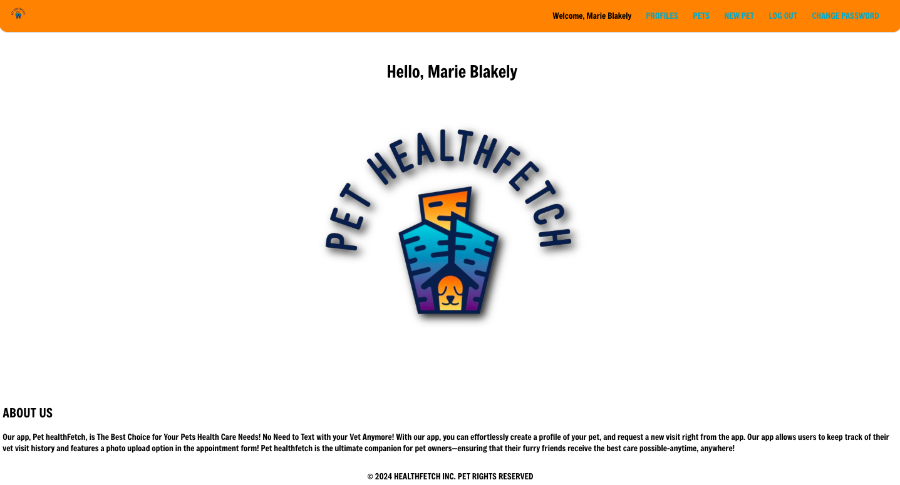

# Pet HealthFetch

## Pet HealthFetch:

### [Pet HealthFetch](https://pet-healthfetch.netlify.app/)

### Description:

##### Pet HealthFetch is the best choice for your pets health care needs. With this app you can effortlessly create a profile for your pet, and request a new visit right from the app. The app allows users to keep track of their vet visit history and features a photo upload option in the appointment form. 

### Planning Materials:

[Planning Materials](https://trello.com/b/8Uei3orD/mern-stack-pet-health-app)

Technologies Used:

* HTML
* JavaScript
* CSS
* Git
* GitHub
* Trello
* Whimsical
* Fly.io
* MongoDB Compass
* Node
* Google OAuth
* Passport.js
* Express

Attributes:
* [Favicon Image](https://www.realsimple.com/thmb/xLA4latZR6rEXcB0S2fYPs7o7ug=/750x0/filters:no_upscale():max_bytes(150000):strip_icc():format(webp)/travel-agent-GettyImages-1211719627-4b924cc562fe4ab4b137b6e4ea9d401d.jpg) 
* [Cinzel Google Font](https://fonts.google.com/selection/embed)
* [Unsplash](https://unsplash.com/photos/flat-lay-photography-of-camera-book-and-bag-qyAka7W5uMY)
* [Animate.css](https://animate.style/)

Icebox Items:
* AAU I want to be able to add a site or restaurant I visited while at the location I traveled to.

